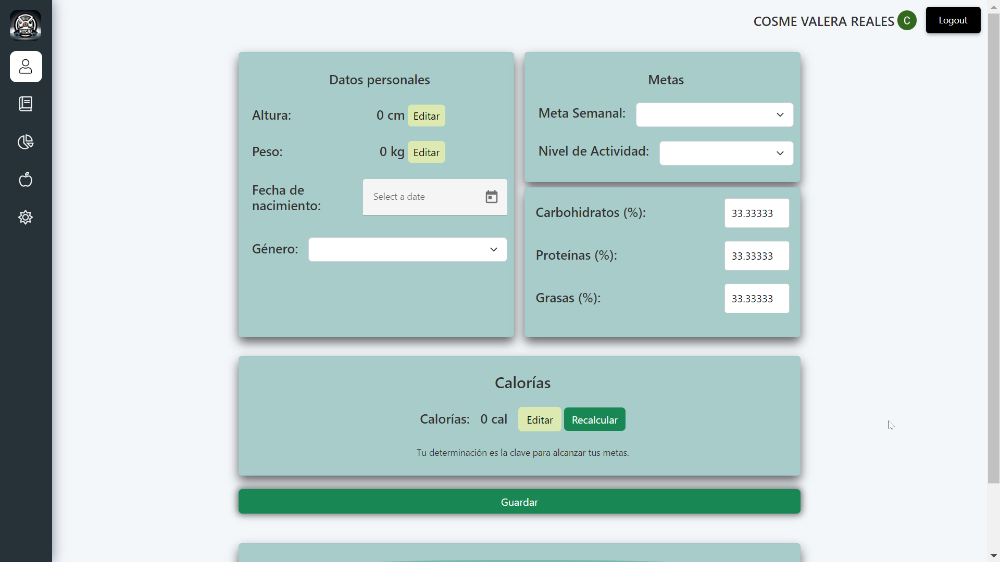
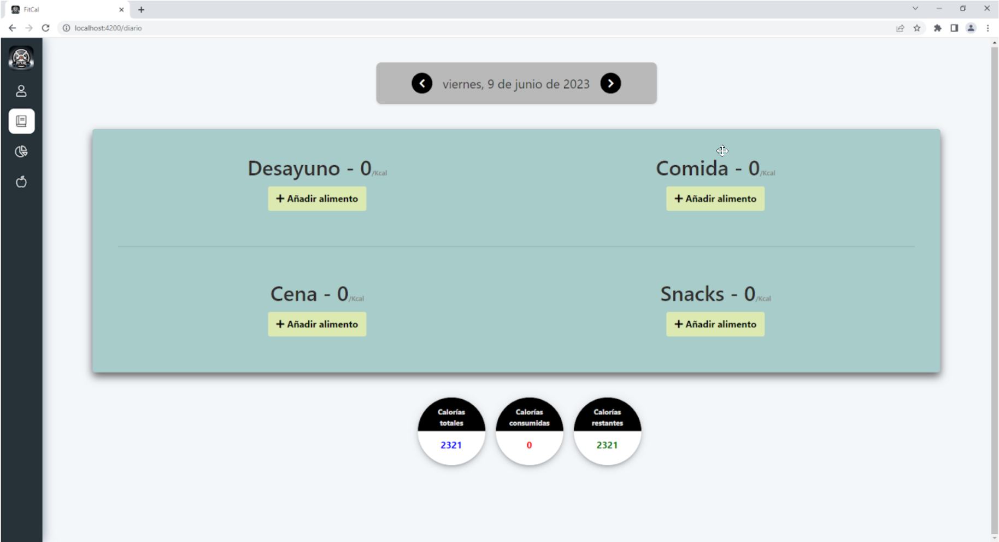
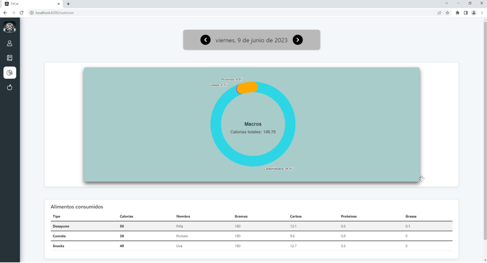

# FitCal

FitCal is a calorie tracking and fitness app that helps you achieve your health goals by tracking your daily food intake, and macronutrient ratios. With FitCal, you can easily log your meals and snacks, track your calorie intake, and monitor your progress towards your daily calorie goals.

## Profile:

- FitCal allows you to set up a profile and customize your daily calorie goals based on your height, weight, age, and activity level. You can track your progress over time and make adjustments to your goals as needed.

## Diary:

- It also provides a simple and intuitive user interface that makes it easy to log your meals and view your progress. You can quickly search and add foods to your daily log, and the app will automatically calculate the calorie count and macronutrient ratios based on the food you've logged.
 
## Nutrition:

- You can keep track of your food intake and macronutrient goals.
 
## Food:

- You can easily create, edit or delete foods from the database. 
 

FitCal is the perfect app for anyone looking to improve their health and fitness. Whether you're trying to lose weight, gain muscle, or just maintain a healthy lifestyle, FitCal has everything you need to achieve your goals.